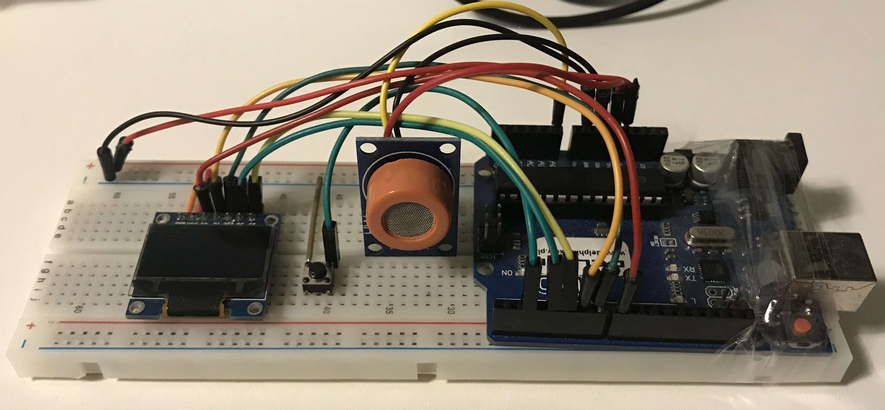

# Arduino MQ-3 Breathalyser

## Table of contents
* [Introduction](#introduction)
* [Images](#images)
* [Features](#features)
* [Technologies](#technologies)

## Introduction
Breathalyzer based on Arduino and MQ-3 sensor.
The MQ-3 sensor measures the alcohol level in the air by changing the output voltage.
The alcohol concentration calculated from the output voltage is shown on the 0,96' display.

## Images
### Picture of the created breathalyser

## Features
A few of the things you can do with this breathalyser:
* Change application language at macro in main.cpp (English and Polish language is supported)
* Continous measurement mode
* Single measurement mode at the click of a button

## Technologies
Project is created with:
* PlatformIO
* C++11
* Adafruit SSD1306 2.4.3
*	Adafruit GFX Library 1.10.5
*	Adafruit BusIO 1.7.2
	
